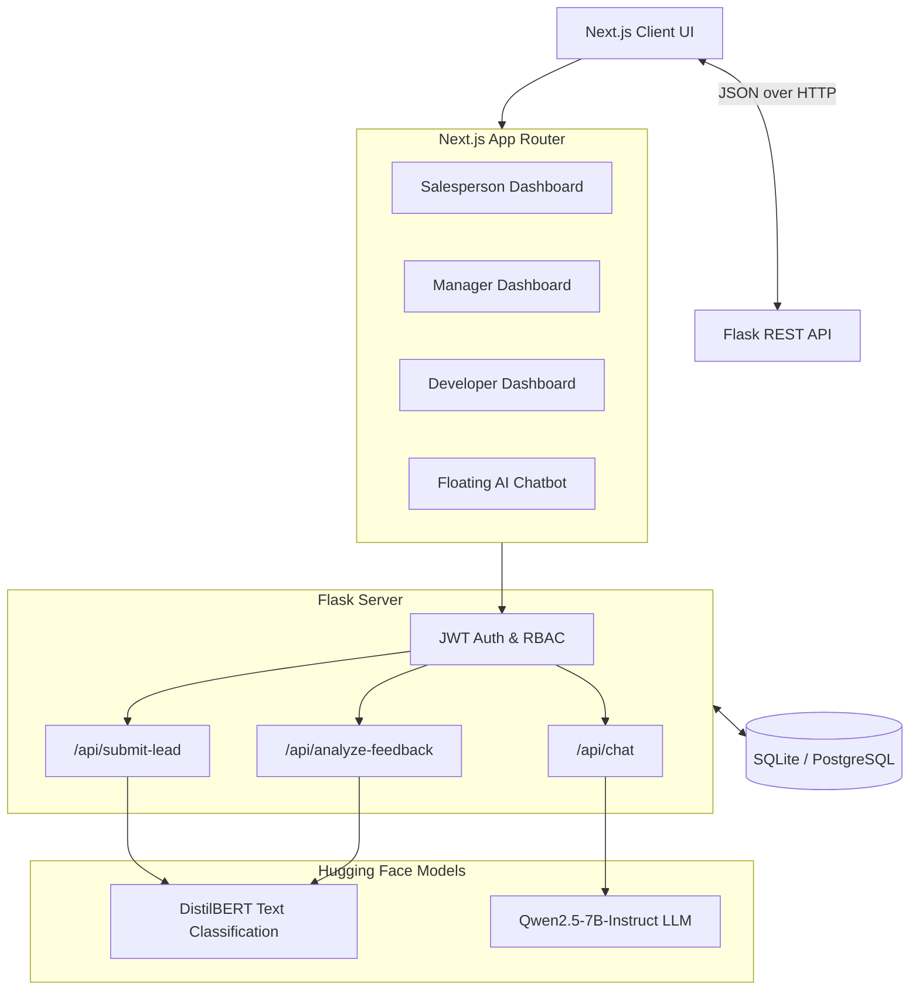
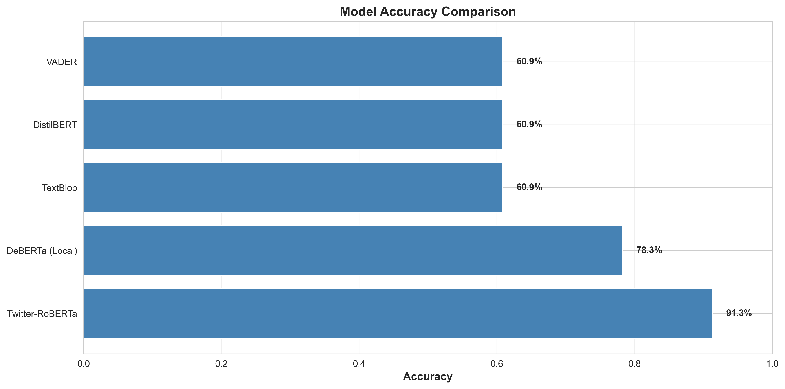

# 📊 InsightGreek-Brain CRM

**An AI-Powered Enterprise CRM prototype featuring dynamic NLP-driven sentiment analysis, intelligent lead scoring, and role-based access control, built with Next.js and Flask.**

### [🌐 Live Web App](https://insightsgreek.vercel.app/) | [🧠 Hugging Face Model Weights](https://huggingface.co/Kaizen696/my_lead_model) | [🚀 HF Gradio Space](https://huggingface.co/spaces/Kaizen696/my_lead_model)

[](https://nextjs.org/)
[](https://tailwindcss.com/)
[](https://python.org)
[](https://flask.palletsprojects.com)
[](https://huggingface.co/inference-api)
[](https://postgresql.org)

---

## 🚀 Project Overview

**InsightGreek-Brain** is a full-stack, AI-first CRM designed to transform raw customer interactions into actionable insights. It couples a blazing-fast, modern Next.js frontend with a robust Python/Flask backend. 

Instead of relying on a monolithic, hardware-heavy local ML runtime, InsightGreek offloads its heavy lifting to the **Hugging Face Inference API**. This decoupled approach enables seamless consumption of advanced AI models (like fine-tuned `DistilBERT` for sentiment/lead scoring and `Qwen2.5-7B-Instruct` for the chatbot) directly via HTTP, making the application incredibly lightweight, easily deployable, and highly scalable.

Access control is rigidly enforced via a **3-tier JWT authentication system** (Developer, Manager, and Salesperson tiers). Data is durably persisted using an extensible **SQLite/PostgreSQL** backend.

---

## ✨ Key Features

- 🎯 **AI Lead Scoring** — Automatically scores inbound leads with confidence percentages using a V2 domain-adapted 3-class `DistilBERT` model to accurately identify high-value prospects.
- 💬 **Intelligent Chat Assistant** — A persistent, floating AI Sales Coach chatbot built directly into the UI. Powered by Qwen2.5, it converses naturally, provides pitch refinement, and natively generates synthetic leads which are instantly validated by the local ML model before being returned to the user.
- 📝 **Grammar & Feedback Analysis** — Processes raw customer feedback text for actionable sentiment classification (Positive/Neutral/Negative) and offers one-click grammar correction via LLM.
- 🎨 **Dynamic UI/UX** — Fully responsive frontend built with **Next.js App Router** and **Tailwind CSS**. Features smooth page transitions, glassmorphism components, interactive gradients, and real-time form validation.
- 🔒 **Role-Based Access Control (RBAC)** — Three distinct tiers of access:
  - **Salesperson**: Submit leads, analyze feedback, and use the AI coach.
  - **Manager**: View aggregated analytics, lead performance across the team, and qualitative visualizations.
  - **Developer**: Access system logs, API health, and model performance metrics.

---

## 🏗️ Architecture Overview



---

## 💻 Tech Stack

### Frontend
- **Framework**: Next.js (App Router, Turbopack)
- **Styling**: Tailwind CSS, PostCSS
- **State/Routing**: React Hooks, `useRouter`
- **Animations**: Custom Keyframe CSS & Tailwind utility classes

### Backend
- **Framework**: Python / Flask 2.x
- **Database**: SQLite (Dev) / PostgreSQL (Prod)
- **Authentication**: JSON Web Tokens (JWT)
- **Async Execution**: Python `threading` for background ML initialization

### Machine Learning & AI
- **LLM/Chatbot**: `Qwen/Qwen2.5-7B-Instruct`
- **Lead/Sentiment Classification**: `Kaizen696/my_lead_model` (V2 3-class domain-adapted DistilBERT model trained on Financial PhraseBank & Sales Data)
- **Inference**: Hugging Face Inference API / Gradio Client

---

## 📈 ML Model Performance

> **Fine-tuned DistilBERT achieves 90% accuracy on sales-domain sentiment classification — outperforming general-purpose baselines including Twitter-RoBERTa (70%) and standard tools like VADER/TextBlob (50%) — while correctly handling neutral sentiment, which 2-class baseline models cannot represent at all.**

Our V2 DistilBERT model underwent a rigorous **Two-Stage Training Pipeline** to adapt it from generic text to highly specialized B2B sales/CRM communications:

| Training Stage | Dataset | Epochs | Overall Accuracy | F1 Score |
|----------------|---------|--------|------------------|----------|
| **Stage 1 (Base)** | Financial PhraseBank (3-class) | 2 | 78.9% | 0.790 |
| **Stage 2 (Domain Adaptation)** | Hand-written sales heuristics (negations, churn, buying signals) | 3 | **85.4%** | **0.854** |

### 🏆 Benchmark Comparison

The model was benchmarked against a diverse hold-out test set of 48 sentences (spanning Simple, Social Media, Slang, Sarcasm, Complex, and Sales-Domain categories) across 5 different models.

#### Overall Accuracy (All 48 Sentences)
| Model | Accuracy |
|-------|----------|
| **InsightGreek Model (v2)** | **85.4%** |
| Twitter-RoBERTa | 77.1% |
| VADER (Rule-based) | 62.5% |
| DistilBERT (SST-2 Baseline) | 58.3% |
| TextBlob (Naive) | 54.2% |



#### Target Use-Case: Sales-Domain Specific Accuracy (25 Sentences)
| Model | Accuracy |
|-------|----------|
| **InsightGreek Model (v2)** | **90.0%** |
| Twitter-RoBERTa | 70.0% |
| TextBlob / VADER / DistilBERT (SST-2) | 50.0% |

### 🔬 Key Findings & Architectural Advantages

1. **Perfect Neutral Handling (12/12):** The 2-class baseline `DistilBERT SST-2` scored 0% (0/12) on neutral-labeled sentences because it structurally cannot output "neutral". By training on the 3-class Financial PhraseBank dataset, our V2 model natively understands and perfectly classified all neutral test cases.
2. **Clean Probability Distribution:** Score distribution boxplots reveal that our V2 model and Twitter-RoBERTa show extremely clean separation (positives cluster near +1, negatives near -1, neutrals strictly near 0). Legacy tools like TextBlob and VADER exhibit messy, overlapping distributions, explaining their high false-positive rates.
3. **Model Agreement (71%):** Our V2 model and Twitter-RoBERTa agreed with each other 71% of the time (the highest agreement rate of any pair). This confirms the fine-tune successfully learned genuine sentiment signals rather than just memorizing noise.

### ⚠️ Known Limitations (Honest Assessment)

We believe in transparent ML evaluation. During testing, we identified two specific areas where the V2 model underperforms:

- **Sarcasm & Slang:** The V2 model was strictly trained on professional financial/sales data. Unsurprisingly, it drops to ~33% accuracy on heavy sarcasm, being completely outperformed by `Twitter-RoBERTa` (67%) which specializes in tweets.
- **Mixed-Signal Lexical Misfires:** The model occasionally struggles with conflicting lexical signals in the same sentence. For example, *"Not interested at all. They are happy with their current vendor."* was misclassified as Positive (High lead score). The model heavily pattern-matched the word *"happy"* to positive training examples and failed to properly weigh the negation.

*Full analysis reports, confusion matrices, and interactive HTML distribution visualizations are available in the `analysis/` directory.*

---

## 🚀 Deployment

The recommended deployment architecture is a **Split Architecture** to maximize Next.js edge caching while running the heavy Python API safely in a server environment.

### 1. Deploy Backend to Render
1. Push your repository to GitHub.
2. In Render, create a new **Web Service**.
3. Keep the Root Directory as `/` (root) because Render uses the root `requirements.txt`.
4. Build Command: `pip install -r requirements.txt`
5. Start Command: `gunicorn --chdir backend app:app` (This points Gunicorn to the backend folder).
6. Copy the resulting backend URL (e.g., `https://insightgreek-api.onrender.com`).

### 2. Deploy Frontend to Vercel
1. In Vercel, import your GitHub repository.
2. Set the Root Directory to `frontend/`.
3. The Build command and Output directory will be auto-detected by Vercel for Next.js.
4. Add an Environment Variable in Vercel:
   - **Key**: `NEXT_PUBLIC_API_URL`
   - **Value**: Your Render Backend URL (e.g., `https://insightgreek-api.onrender.com`)
   *The `next.config.ts` uses this variable to proxy API requests in production.*

### 3. CI/CD Pipeline
- A GitHub Actions workflow (`pytest.yml`) is included in `.github/workflows/`.
- Every push or pull request to the `main` branch automatically triggers backend tests (e.g., RBAC authorization validation) via `pytest`.

---

## 🛠️ Local Development Setup

### 1. Prerequisites
- **Node.js** 18+ (for frontend)
- **Python** 3.10+ (for backend)

### 2. Backend Setup

```bash
cd backend
python -m venv venv
source venv/bin/activate          # Windows: venv\Scripts\activate
pip install -r requirements.txt
```

> **Note:** The backend automatically connects to Hugging Face APIs via `gradio_client` and `huggingface_hub`. No heavy local `torch` or `transformers` installations are required.

Start the backend:
```bash
python app.py
```
*The Flask server will start on `http://127.0.0.1:5000`.*

### 3. Frontend Setup

In a new terminal window:
```bash
cd frontend
npm install
npm run dev
```
*The Next.js server will start on `http://localhost:3000` and automatically proxy `/api/*` requests to the Flask backend on port 5000.*


## 🌐 Status
*The application is fully functional end-to-end. Next.js is actively deployed to Vercel, and the Flask API is running on Render with automated GitHub Actions CI/CD enforcing code stability.*
```
